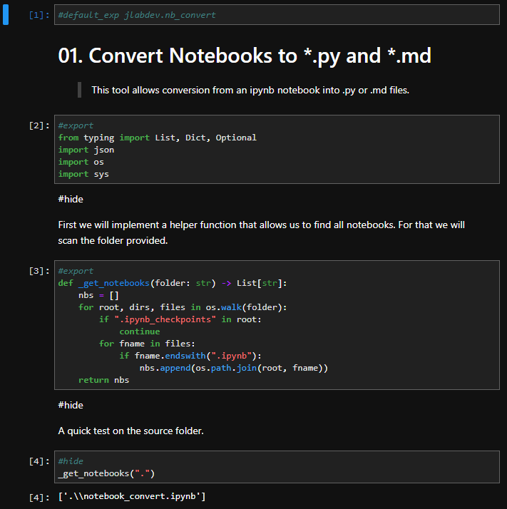

# JLAB Dev

> Develop python packages using jupyterlab.

This library allows you to develop regular python packages while writing your code in jupyterlab.
You can create notebooks to develop your code and in these notebooks, simply annotate your cells with `#export` if you want them to be put in the library. (A notebook must be marked for conversion with `#convert` in the first code cell.)
Other cells will be used as examples in your doc (together with the markdown of your notebook) unless marked with `#hide`.



Of course JLAB Dev itself is completly implemented as a notebook in jupyterlab (see [here](jlabdev/convert.ipynb)).

## Installation

It is as simple as a pip install.

```bash
# For stable version
pip install jlabdev

# or for bleeding edge
pip install git+https://github.com/penguinmenac3/jlabdev.git
```

## Usage

### Basics

Simply create your notebooks and add a code cell with `#convert` as the first cell and annotate all cells you want to export with `#export`.

Now you can compile your notebook into python and markdown doc by saving it and then running these commands at the root of your project folder:

```bash
nb2py  # Creates python files next to the notebooks
nb2md  # Creates markdown doc in docs
```

When you edit your python file (e.g. refactoring) and want to update the notebook from the python file.

```bash
py2nb
```

# Documentation

Documentation can be found in [docs](docs/README.md) it will be automatically generated there. The README.md is an overview over all packages availible.


# License

The MIT License (MIT)

Copyright (c) 2020 Michael Fuerst

Permission is hereby granted, free of charge, to any person obtaining a copy
of this software and associated documentation files (the "Software"), to deal
in the Software without restriction, including without limitation the rights
to use, copy, modify, merge, publish, distribute, sublicense, and/or sell
copies of the Software, and to permit persons to whom the Software is
furnished to do so, subject to the following conditions:

The above copyright notice and this permission notice shall be included in all
copies or substantial portions of the Software.

THE SOFTWARE IS PROVIDED "AS IS", WITHOUT WARRANTY OF ANY KIND, EXPRESS OR
IMPLIED, INCLUDING BUT NOT LIMITED TO THE WARRANTIES OF MERCHANTABILITY,
FITNESS FOR A PARTICULAR PURPOSE AND NONINFRINGEMENT. IN NO EVENT SHALL THE
AUTHORS OR COPYRIGHT HOLDERS BE LIABLE FOR ANY CLAIM, DAMAGES OR OTHER
LIABILITY, WHETHER IN AN ACTION OF CONTRACT, TORT OR OTHERWISE, ARISING FROM,
OUT OF OR IN CONNECTION WITH THE SOFTWARE OR THE USE OR OTHER DEALINGS IN THE
SOFTWARE.
